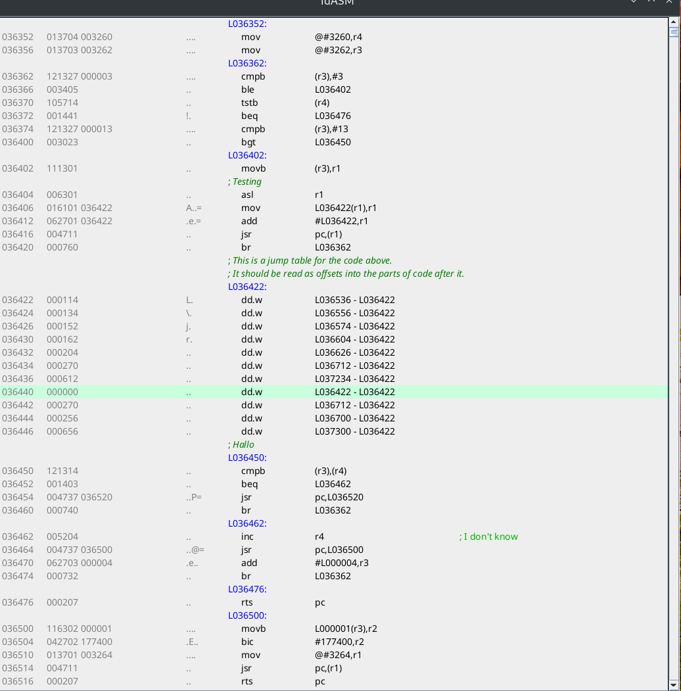

# Interactive disassembler #

This is a quick and dirty attempt to create an interactive disassembler using Java Swing.
This allows it to be multiplatform easily. It is meant to be generic; the idea would be that
it is easy to add new disassemblers by just implementing some interface. It currently
has only a pdp-11 disassembler, and this also means that not everything is properly
generalized; that will come with the next disassembler module (the z80, most probably).

## Overview
For now there is not a lot of UI because writing that is boring. It might improve in the future.
You start the thing using the command line:

```aiignore
java -jar idas.jar -i [input file name] -g
```
The file to load can currently be in raw binary format (.bin extension) or in XXDP .BIC format. Loading
data is done by loaders; it should be very simple to write loaders for other file formats.

As there is currently no other disassembler but the pdp-11 one there is no option to pick the type.

Once started you should see the disassembly window:

The window shows the disassembly, and it allows you to change the disassembly, 
as follows:

* Select an area with the mouse (click, shift+click), then use the right 
  click menu to define the area as something other than code, like data 
  as bytes, data as words, strings...
* Press the letter l (lowercase) to rename a label to a more user friendly name
* Press the ; to add/edit a line comment after a line
* Press the / key to add a block comment before the selected line

More actions to follow.

## Innards
The biggest part of the code is the disassembler window. This uses a simple two 
pass disassembly using the currently selected IDisassembler (pdp11 only, currently).
In the first pass the disassembler will calculate labels, the second pass will
be used to actually generate the UI. The second pass will calculate a line table 
and a line offset table so that we can quickly find addresses per line and 
addresses from screen offsets. This is used to repaint the screen when 
things happen. This means we keep very little in memory; when the screen changes 
we just call the disassembler again to generate its output for the selected part.

Within a binary you will have data regions and code regions, and often there
is a lot of data stored in the code part. This will confuse the disassembly, 
of course, because it will disassemble the data leading to nonsense. To fix
this you can select an address range and define that as being data of some type;
these are called _regions_ in the code. Initially the entire address space will
be treated as a single region of type _code_, but as new regions gets added the
address space is divided into code and data regions.
The disassembler will be called for code regions. For data regions a special class
called a data disassembler will be used. This will present the data in whatever
format was selected for a region.

## Todo's

### Different presentations for numbers/addresses
What really needs more work (which will come once I add the Z80 as a target) is
everything related to the rendering of addresses and data in the proper base for
whatever platform. I also need to work at being able to switch from word to 
byte easily, especially for selecting area's to assign a different type.

### Selection of different disassembly modules
I should implement a Z80 disassembler asap to make the code more generic 
before it's too late..

### pdp-11: recognize more special constructs
I imagine that there are special calls/traps that would usually cause some
OS action to be executed, depending on the OS that a piece of code is written
for. It would be good to be able to specify that, and to allow the disassembler
to disassemble these as recognizable calls. This will require quite some studying
though; to start with whatever services are exposed by xxdp.

## Mandatory warnings
This is a work in progress and I'm not sure it will even finish ;)
